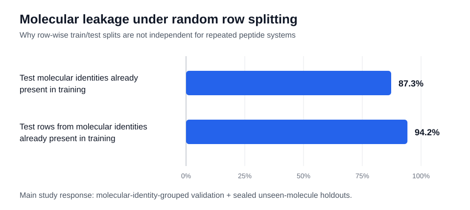
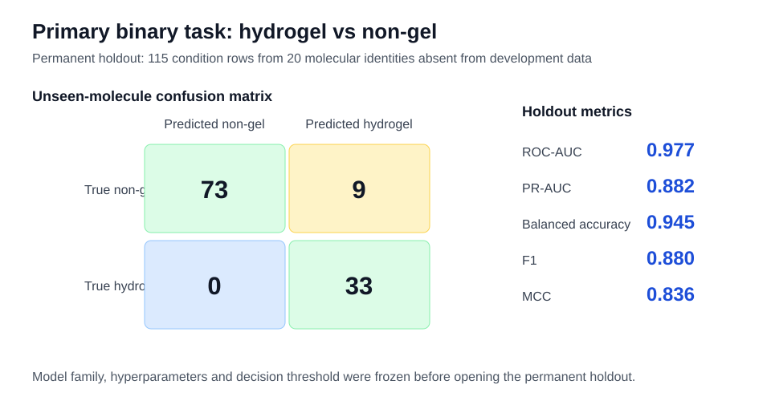
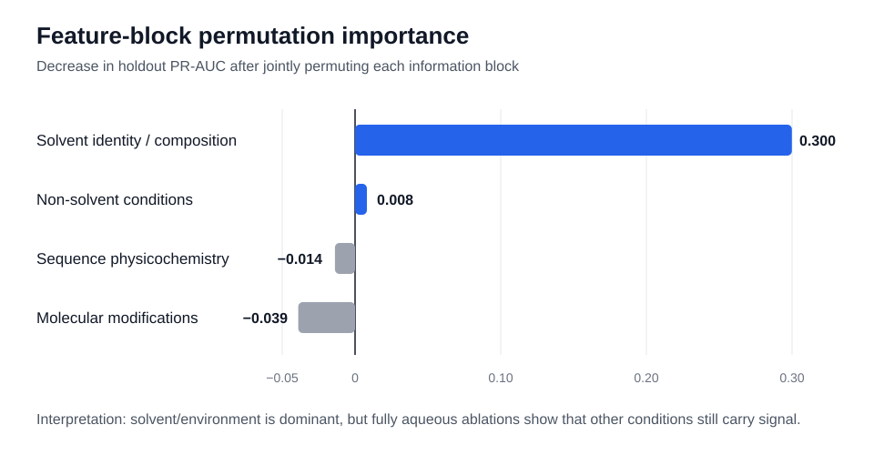
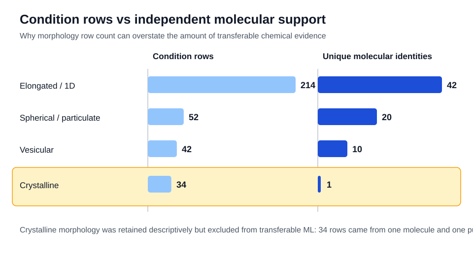

# Condition-Aware Machine Learning for Short-Peptide Self-Assembly

Machine learning of **short-peptide bulk state and supramolecular morphology** using peptide chemistry together with experimental conditions, with explicit controls for molecular-identity leakage.

Self-assembly is treated as a molecule–environment problem: the observed state depends on both the chemistry of the peptide system and the conditions under which it is assembled.

## Study highlights

- Curates condition-level records from **PeptideMiner** and **SAPdb** with publication/provenance checks.
- Reconstructs chemically meaningful molecular identities from sequence, topology, terminal modifications and conjugation information.
- Uses 58 molecular and experimental-condition features.
- Quantifies the leakage produced by conventional random row splitting.
- Uses molecular-identity-grouped development and permanently held-out unseen molecules for the main generalization claims.
- Adds publication-aware robustness analyses and molecule-cluster bootstrap confidence intervals.
- Separates transferable broad morphology modelling from fine-grained classes that lack sufficient independent chemical support.

## Key results

| Prediction task | Independent holdout | Selected model | Main performance |
|---|---:|---|---|
| Hydrogel vs non-gel | 115 rows, **20 unseen molecules** | Random Forest | ROC-AUC **0.977**, PR-AUC **0.882**, balanced accuracy **0.945**, MCC **0.836** |
| Non-gel vs hydrogel vs organogel | 129 rows, **20 unseen molecules** | Histogram Gradient Boosting | Macro ROC-AUC **0.783**, macro PR-AUC **0.555**, balanced accuracy **0.613**, MCC **0.247** |
| Broad morphology | 59 rows, **14 unseen molecules** | Extra Trees | Macro ROC-AUC **0.980**, macro PR-AUC **0.925**, balanced accuracy **0.711**, MCC **0.665** |

The holdouts contain limited numbers of independent molecular systems, so these point estimates should be interpreted together with the molecule-cluster bootstrap confidence intervals reported in the analysis notebook.

## Molecular leakage under random row splitting



Approximately **87.3% of nominal test molecular identities** in a conventional random split were already represented in training, and approximately **94.2% of test rows** came from molecular identities already represented in training. This is why row-wise random splitting is not used for the primary transfer claims.

## Binary hydrogel prediction on unseen molecules



The hydrogel/non-gel model family, hyperparameters and classification threshold were selected using development data before evaluation on the permanent unseen-molecule holdout. The final holdout confusion matrix was **TN 73, FP 9, FN 0, TP 33**.

## Experimental environment matters



Solvent identity/composition is the dominant transferable information block in the binary model. However, fully aqueous analyses show that concentration, pH, temperature and related non-solvent conditions retain predictive information even when solvent-composition variation is removed.

## Independent support for morphology



Condition-row count can substantially overstate independent chemical support. The crystalline class, for example, contains 34 observations but only **one molecular identity and one publication**; it is therefore retained descriptively but excluded from transferable broad-morphology classification.

## Scientific conclusions

1. **Curation is part of the modelling problem.** Bulk-state and morphology labels require source-, solvent- and provenance-aware reconstruction before machine learning.
2. **Self-assembly is condition dependent.** Peptide chemistry and the experimental environment should be represented jointly.
3. **Leakage-aware validation changes the meaning of performance.** Random row-wise splits are unsuitable for claims about unseen peptide systems when repeated conditions from the same molecule are present.
4. **Binary hydrogel prediction transfers strongly to unseen molecular identities**, subject to the uncertainty implied by the limited independent holdout size.
5. **Three-class bulk-state prediction is substantially harder**, particularly for organic non-gelling systems versus organogels.
6. **Broad morphology is learnable, but independent support is uneven across classes.**
7. The current descriptor set does not fully encode **residue order, three-dimensional packing or supramolecular interaction geometry**, which is consistent with several analogue and composition-isomer errors.

## Fine-grained morphology

The four-class fine-morphology subset contains 257 condition rows from 57 molecular identities. After reserving an unseen-molecule holdout, the development set could not support stable three-fold molecularly independent cross-validation while maintaining the prespecified rare-class support requirements. The fine-grained predictive task was therefore not pursued by weakening molecular-independence safeguards.

This is an **independent-support limitation**, not a failed classifier.

## Repository structure

```text
peptide-self-assembly-ml/
├── README.md
├── CITATION.cff
├── environment.yml
├── requirements.txt
├── data/
│   └── README.md
├── figures/
│   ├── README.md
│   ├── readme_figure_1_leakage.svg
│   ├── readme_figure_2_binary_holdout.svg
│   ├── readme_figure_3_feature_blocks.svg
│   └── readme_figure_4_morphology_support.svg
└── notebooks/
    ├── README.md
    └── Condition_Aware_Peptide_Self_Assembly_ML.ipynb
```

## Reproducibility

### 1. Clone the repository

```bash
git clone https://github.com/dennisorji/peptide-self-assembly-ml.git
cd peptide-self-assembly-ml
```

### 2. Create the environment

With Conda:

```bash
conda env create -f environment.yml
conda activate peptide-self-assembly-ml
```

or with pip:

```bash
pip install -r requirements.txt
```

### 3. Obtain the source data

Follow [`data/README.md`](data/README.md) and place the two expected CSV files under `data/raw/`:

```text
data/raw/peptideminer_phase_data_clean.csv
data/raw/sapdb_v1.csv
```

The raw source datasets are intentionally not duplicated in this repository; the data README links to the upstream resources.

### 4. Run the analysis

Launch Jupyter from the repository directory and open:

[`notebooks/Condition_Aware_Peptide_Self_Assembly_ML.ipynb`](notebooks/Condition_Aware_Peptide_Self_Assembly_ML.ipynb)

The notebook writes generated datasets, tables, model objects and publication figures to `paper_outputs/`. That directory is ignored by Git because it is reproducible from the source data and notebook.

## Data sources

- **PeptideMiner** — Yang, Yorke, Knowles & Buehler, *PeptideMiner: Learning the rules of peptide self-assembly through data mining with large language models*. Source repository: https://github.com/lamm-mit/PeptideMiner
- **SAPdb** — Mathur, Kaur, Dhall, Sharma & Raghava (2021), *SAPdb: A database of short peptides and the corresponding nanostructures formed by self-assembly*, *Computers in Biology and Medicine*, 133, 104391. https://doi.org/10.1016/j.compbiomed.2021.104391

SAPdb v1 is also archived at https://doi.org/10.5281/zenodo.20078457.

## Limitations

The molecular holdouts are intentionally independent but modest in size. Broad-morphology uncertainty is especially wide because the permanent holdout contains only 14 molecular identities and only two vesicular identities. Publication-familiarity analyses also do not justify a universal unseen-publication morphology claim because the unseen-publication subset in that analysis contains only elongated/1D examples.

The descriptor representation is primarily composition- and physicochemistry-aware and does not fully resolve sequence order or supramolecular packing. These limitations define the most important directions for future representation and data-development work.

## Citation

Citation metadata for this repository is provided in [`CITATION.cff`](CITATION.cff).
